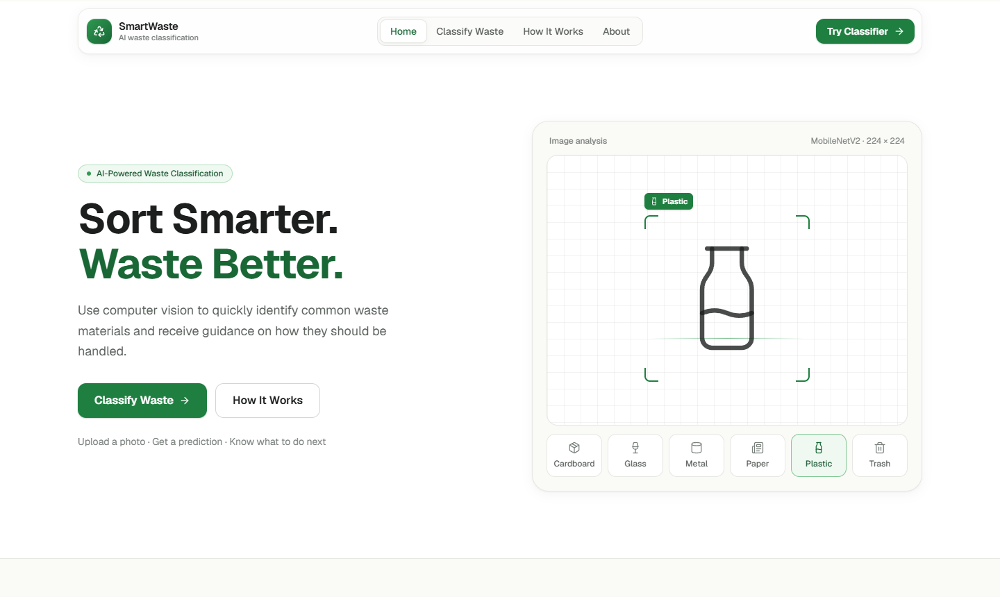
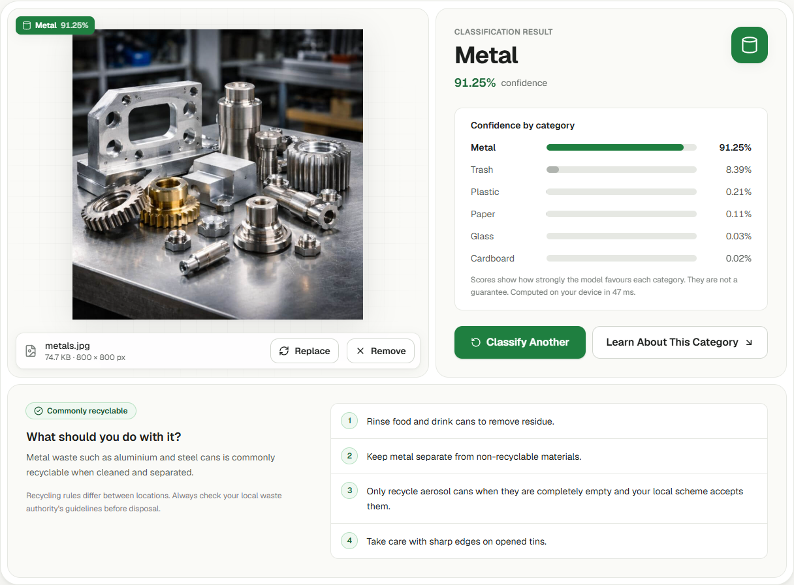

# SmartWaste

**AI-powered waste classification that runs entirely in your browser.**

SmartWaste identifies the material of a waste item from a photo — **cardboard, glass, metal, paper, plastic or trash** — and gives general guidance on how to dispose of it. The classifier is a MobileNetV2 network trained with transfer learning and served with ONNX Runtime Web, so images never leave the user's device.

[](https://smartwaste-cv.vercel.app)




## Features

- **Private by design.** Inference runs client-side in WebAssembly. Images are never uploaded or stored.
- **Simple upload flow.** Drag and drop or browse for a JPG, PNG or WEBP image (up to 20 MB), review it, then analyze.
- **Transparent results.** The predicted category, the confidence for all six classes, and a clear warning when confidence is below 60%.
- **Disposal guidance.** Recyclability and practical handling tips for each category.
- **Responsive and accessible.** Works from small phones to wide desktop screens, with keyboard navigation, visible focus states and reduced-motion support.



## How it works

```text
Image upload → decode & resize to 224×224 RGB → MobileNetV2 (ONNX, in the browser) → softmax over 6 classes → result + guidance
```

The browser reproduces the training pipeline's preprocessing exactly: EXIF-aware decoding and an antialiased bilinear resize with the same sampling as TensorFlow's `tf.image.resize`. MobileNetV2's input scaling (`x / 127.5 − 1`) is built into the exported model, so the web app sends raw 0–255 RGB values. Class order, input shape and evaluation metrics are read from `public/model/metadata.json`, which keeps the app and the model in sync.

## Dataset

The model is trained on three public datasets, mapped to six shared classes. Counts are after cleaning:

| Class | [TrashNet](https://github.com/garythung/trashnet) | [RealWaste](https://archive.ics.uci.edu/dataset/908/realwaste) | [Garbage Dataset](https://huggingface.co/datasets/steveharianto/waste-garbage-management-dataset) | Total |
|---|---:|---:|---:|---:|
| Cardboard | 403 | 461 | 946 | 1,810 |
| Glass | 501 | 420 | 966 | 1,887 |
| Metal | 409 | 790 | 597 | 1,796 |
| Paper | 589 | 500 | 870 | 1,959 |
| Plastic | 480 | 921 | 926 | 2,327 |
| Trash | 137 | 495 | 802 | 1,434 |
| **Total** | **2,519** | **3,587** | **5,107** | **11,213** |

- **TrashNet** contains single objects on a plain white background.
- **RealWaste** contains items photographed at a landfill, adding cluttered, real-world conditions. Its *Miscellaneous Trash* class maps to *trash*. *Food Organics*, *Vegetation* and *Textile Trash* have no matching class and are excluded.
- The **Garbage Dataset** (MIT licence) adds varied web and phone photos, the kind people upload to the app. It already contains most of TrashNet, so those 2,523 copies are detected with a perceptual hash and skipped. Up to 1,000 of the remaining photos per class are sampled with a fixed seed so no single source dominates a class. *Biological*, *Battery*, *Shoes* and *Clothes* are excluded.
- Cleaning removes 3 byte-identical duplicates and 319 near-duplicates (the same picture re-saved or resized), so no image can appear in both the training and test sets.
- The images are split **70 / 15 / 15** into train (7,849), validation (1,682) and test (1,682). The split is stratified by class and source, uses a fixed seed (`42`), and is checked for overlap by both file name and image content.

## Model

| | |
|---|---|
| Base network | MobileNetV2, ImageNet weights |
| Classification head | Global average pooling → Dropout (0.2) → Dense (256, ReLU, L2 1e-4) → Dropout (0.4) → Dense (6, softmax) |
| Stage 1 | Frozen base, head trained with Adam (1e-3) |
| Stage 2 | Fine-tuning from `block_13_expand` with Adam (1e-5) |
| Regularisation | Data augmentation (flip, rotation, zoom, translation, contrast, brightness), dropout, L2, class weights, early stopping |
| Export | ONNX (opset 17), verified against Keras on all 1,682 test images (max difference < 2e-5, 100% top-1 agreement) |

## Results

Evaluated once on the held-out test set (1,682 images), model version 1.1.0:

| Accuracy | Macro precision | Macro recall | Macro F1 |
|---:|---:|---:|---:|
| **88.3%** | 88.7% | 88.2% | 88.4% |

| Class | Precision | Recall | F1 | Test images |
|---|---:|---:|---:|---:|
| Cardboard | 0.911 | 0.867 | 0.889 | 271 |
| Glass | 0.891 | 0.898 | 0.894 | 283 |
| Metal | 0.869 | 0.911 | 0.890 | 270 |
| Paper | 0.865 | 0.935 | 0.899 | 294 |
| Plastic | 0.858 | 0.845 | 0.851 | 349 |
| Trash | 0.928 | 0.837 | 0.880 | 215 |

By source: **94.7%** on Garbage Dataset test images, **83.6%** on TrashNet and **82.5%** on RealWaste.

Adding the Garbage Dataset is what made the model reliable on web and phone photos. On the same 767 unseen Garbage Dataset images, the previous two-dataset model (1.0.0) scored 59.5% and this model scores 94.7%. On the 142 TrashNet and RealWaste test images unseen by both models, the two are within three images of each other (81.7% vs 79.6%).

<p align="center">
  
</p>

Training curves are available in [`docs/training_curves.png`](docs/training_curves.png).

### Limitations

- The model only knows six categories. Every image is assigned to one of them, even if it shows something else.
- The most common errors are cardboard predicted as paper, plastic as glass, and glass as plastic.
- Scenes unlike any training photo, such as industrial metal stock (pipes, beams, bars) or overflowing bins, can still be misclassified. The app marks low-confidence results as uncertain.
- Photos with several items, heavy clutter or poor lighting can be misclassified, sometimes with high confidence.
- Disposal guidance is general. Recycling rules vary by location.

## Getting started

**Prerequisites:** Node.js 20.9 or newer.

```bash
git clone https://github.com/anniesrdnl/smart-waste.git
cd smart-waste
npm install
npm run dev
```

Open <http://localhost:3000>. The `predev` and `prebuild` scripts copy the ONNX Runtime Web assets from `node_modules` into `public/ort/`.

| Command | Description |
|---|---|
| `npm run dev` | Start the development server |
| `npm run build` | Create a production build |
| `npm run start` | Serve the production build |
| `npm run typecheck` | Run the TypeScript compiler without emitting files |

## Training

The full pipeline is in [`training/smart_waste_training.ipynb`](training/smart_waste_training.ipynb). It covers:

1. Downloading the datasets.
2. Cleaning, deduplicating and splitting the data.
3. Training and fine-tuning.
4. Evaluation, including per-source metrics.
5. ONNX export and parity checks.

To retrain:

1. Open the notebook in Google Colab with a GPU runtime, or locally with the packages in [`training/requirements.txt`](training/requirements.txt).
2. Run all cells. The notebook writes `smart_waste_mobilenetv2.onnx` and `metadata.json` to `artifacts/web_model/`.
3. Copy both files into `public/model/`. The web app picks up the new classes, input format and metrics automatically.

## Deployment

The app is a static Next.js site and needs no server or environment variables. It is deployed on [Vercel](https://vercel.com): import the repository and keep the default Next.js settings. Every push to `main` triggers a new deployment.

## Project structure

```text
app/              Root layout, page and global styles
components/       UI components (header, classifier workspace, content sections)
lib/              Preprocessing, model loading, error handling, class data
types/            Shared TypeScript types
public/model/     Trained ONNX model and metadata
scripts/          Build helper that copies ONNX Runtime Web assets
training/         Training notebook and Python requirements
docs/             Screenshots and evaluation figures
```

## Tech stack

Next.js · React · TypeScript · Tailwind CSS · TensorFlow / Keras · ONNX · ONNX Runtime Web · Vercel

## Acknowledgements

- **TrashNet** — G. Thung and M. Yang, *Classification of Trash for Recyclability Status*, Stanford CS229, 2016.
- **RealWaste** — S. Single, S. Iranmanesh and R. Raad, *RealWaste: A Novel Real-Life Data Set for Landfill Waste Classification Using Deep Learning*, Information 14(12), 2023. Licensed under [CC BY 4.0](https://creativecommons.org/licenses/by/4.0/).
- **Garbage Dataset** — S. Kunwar, *Garbage Dataset* (10 classes), via the [Hugging Face mirror](https://huggingface.co/datasets/steveharianto/waste-garbage-management-dataset). Licensed under MIT.
- **MobileNetV2** — M. Sandler et al., *MobileNetV2: Inverted Residuals and Linear Bottlenecks*, CVPR 2018.
