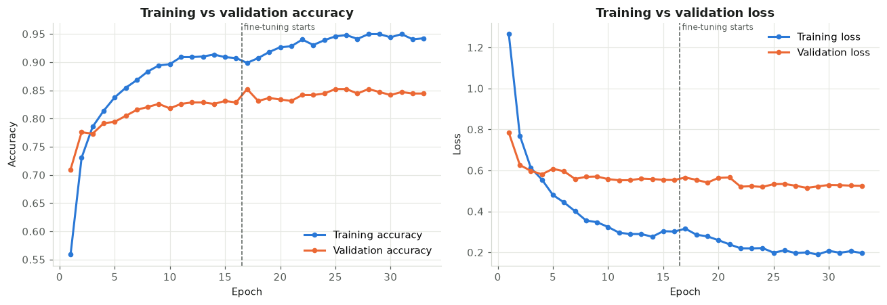
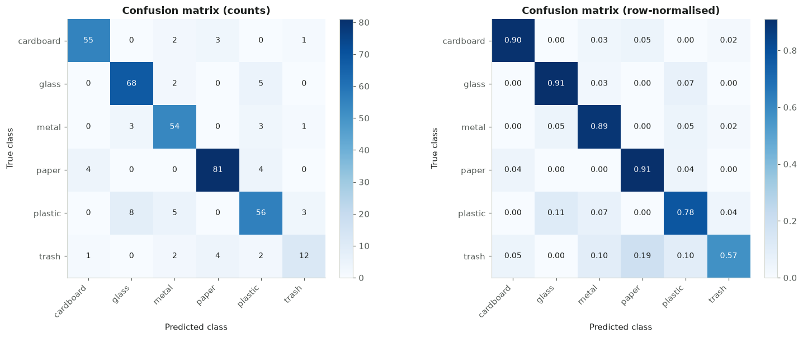

# Smart Waste Classification System

Smart Waste identifies common waste materials from an uploaded photo. It uses a **MobileNetV2** network trained with **transfer learning and fine-tuning**. The model runs **entirely in the browser**, so the deployed site on **Vercel** needs no Python server, no Google Colab session and no machine of yours left running.

```text
Upload Waste Photo → Preview → Classify Waste → MobileNetV2 (in-browser) → Category + Confidence → Six Class Probabilities → Disposal Guidance
```

---

## Overview

The project has two parts that share one contract:

| Part | Location | Technology | Purpose |
|---|---|---|---|
| Training pipeline | [`training/smart_waste_training.ipynb`](training/smart_waste_training.ipynb) | Python, TensorFlow/Keras, scikit-learn | Dataset preparation, training, fine-tuning, evaluation, export to ONNX |
| Web application | repository root (`app/`, `components/`, `lib/`) | Next.js, React, TypeScript, Tailwind CSS, ONNX Runtime Web | Upload-only interface that runs the exported model in the browser |
| Contract | `public/model/metadata.json` | JSON written by the notebook | Class order, input size, colour order, pixel range, real metrics |

## Project Objectives

- Build an image classifier for six waste categories using transfer learning on MobileNetV2.
- Follow sound ML practice: a cleaned dataset, a stratified split with a fixed seed, an untouched test set, class weights, augmentation, early stopping and staged fine-tuning.
- Report honest evaluation results: accuracy, precision, recall, F1-score, a confusion matrix and per-class analysis.
- Deploy the trained model as a polished, responsive web application on Vercel with browser-side inference.

## Features

- **Upload-only input**: drag and drop or browse for an existing JPG, JPEG, PNG or WEBP image. There is no camera access anywhere in the app.
- File validation that catches a missing file, an unsupported format, an empty file, a file over 20 MB, and corrupted or undecodable images.
- An image preview showing the filename, file size and dimensions, with **Replace Image**, **Remove Image** and an explicit **Classify Waste** button. Nothing is classified automatically.
- Clear model states: *Loading classification model...*, *Model ready*, *Analyzing image...*, *Model unavailable*.
- The model is loaded once, lazily (when the classifier section approaches the viewport), cached in memory and reused for every prediction.
- Results show the predicted category, its confidence, all six probabilities sorted from highest to lowest, and a low-confidence notice when it applies.
- General disposal guidance for each category.
- **Classify Another Image** resets the classifier without reloading the page.
- Privacy: the image is processed locally in the browser and is never uploaded.
- Two honest states. **Before training**, the interface works but states that the trained model has not been added yet, and classification stays disabled. **After training**, real predictions come from the deployed model.

## Supported Waste Categories

| Category | Typical items | General recyclability |
|---|---|---|
| Cardboard | Boxes, cartons, packaging | Generally recyclable when clean and dry |
| Glass | Bottles, jars | Often recyclable, depending on glass type and facilities |
| Metal | Cans, tins, foil | Commonly recyclable when cleaned and separated |
| Paper | Newspaper, office paper, magazines | Generally recyclable when clean |
| Plastic | Bottles, containers, packaging | Depends heavily on the plastic type and local facilities |
| Trash | Mixed, soiled or non-recyclable items | Usually residual (general) waste |

Guidance is general because recycling rules differ by location.

## Dataset

**TrashNet** by Gary Thung and Mindy Yang (Stanford CS229, *Classification of Trash for Recyclability Status*, 2016).

- Source: <https://github.com/garythung/trashnet> (mirror: <https://huggingface.co/datasets/garythung/trashnet>)
- File used: `data/dataset-resized.zip` (42,834,870 bytes), the authors' resized version.
- Classes: cardboard, glass, metal, paper, plastic, trash. These match this project exactly.
- Each photo shows one object on a plain white background.

Check the repository for licence and citation terms before redistributing the images.

**Limitations:** the dataset is small, the *trash* class is much smaller than the others, and every photo has a plain background. Accuracy on real-world photos with cluttered backgrounds is usually lower than the test accuracy reported here.

## Dataset Preparation

The notebook does all of this automatically:

1. Downloads the archive, falling back to the Hugging Face mirror, and checks its exact size.
2. Finds the six class folders inside the archive and copies them into `dataset/<class>/`.
3. Analyses the dataset: counts per class, a distribution chart, the imbalance ratio, sample images and image sizes.
4. Cleans it: unsupported files, empty files, images Pillow or TensorFlow cannot decode, and exact duplicates (by MD5) are moved to `dataset_rejected/` and listed. The notebook stops if more than 5% of files are rejected.
5. Splits it **70% train / 15% validation / 15% test**, stratified by class, with `SEED = 42`. It asserts that no file and no identical image appears in two splits, and saves the split lists as CSV.

## Model Architecture

```text
Input (224 × 224 × 3, RGB, values 0–255)
  ↓ Data augmentation (flip, ±18° rotation, ±10% zoom, ±8% translation, ±15% contrast) — active only in training
  ↓ Rescaling(1/127.5, offset = −1)  ← MobileNetV2 preprocessing, embedded in the model
  ↓ MobileNetV2 base (ImageNet weights, include_top = False)
  ↓ GlobalAveragePooling2D
  ↓ Dropout(0.2)
  ↓ Dense(256, ReLU, L2 1e-4)
  ↓ Dropout(0.4)
  ↓ Dense(6, softmax)
```

MobileNetV2's normalisation is part of the model, so the model accepts plain RGB pixels in the 0–255 range, which is exactly what a browser canvas produces. Training and deployment therefore cannot drift apart on normalisation.

## Transfer Learning

MobileNetV2 is loaded with ImageNet weights and its base is **frozen**. Only the new head is trained:

- Adam, learning rate `1e-3`, sparse categorical cross-entropy, accuracy metric
- Class weights (scikit-learn `"balanced"`, computed from the training split) when the training classes are imbalanced by more than 1.5×
- `EarlyStopping(patience=5, restore_best_weights=True)`, `ReduceLROnPlateau(factor=0.3, patience=2)` and `ModelCheckpoint(save_best_only=True)`. All three monitor **validation** loss.

## Fine-Tuning

- MobileNetV2 is unfrozen from `block_13_expand` to the end, roughly the top quarter of the network. Earlier layers stay frozen.
- BatchNormalization layers stay frozen, and the base runs in inference mode.
- Learning rate `1e-5`, up to 20 additional epochs, with the same callbacks.
- The fine-tuned checkpoint is kept only if it beats the head-only model's best validation loss. This choice uses validation data only.

Why only partly: early layers learn generic edges and textures that transfer well as they are. Unfreezing the whole network on a few thousand images risks destroying those features and over-fitting.

## Model Evaluation

The final model is evaluated **once** on the held-out test set, which is never used for training, early stopping, checkpoint selection or tuning.

Results of the run included in this repository (model version 1.0.0, trained on CPU with `SEED = 42`). These values come directly from the executed notebook ([`training/smart_waste_training.ipynb`](training/smart_waste_training.ipynb), Section 13) and are embedded in `public/model/metadata.json`:

| Metric | Value |
|---|---|
| Test images | 379 |
| Test accuracy | **86.02%** |
| Test loss | 0.4578 |
| Macro precision | 83.91% |
| Macro recall | 82.55% |
| Macro F1-score | 83.08% |
| Weighted F1-score | 85.88% |

| Class | Precision | Recall | F1-score | Test images |
|---|---|---|---|---|
| Cardboard | 0.9167 | 0.9016 | 0.9091 | 61 |
| Glass | 0.8608 | 0.9067 | 0.8831 | 75 |
| Metal | 0.8308 | 0.8852 | 0.8571 | 61 |
| Paper | 0.9205 | 0.9101 | 0.9153 | 89 |
| Plastic | 0.8000 | 0.7778 | 0.7887 | 72 |
| Trash | 0.7059 | 0.5714 | 0.6316 | 21 |

**Interpretation:** paper and cardboard are recognised most reliably. **Trash** (F1 0.63) and **plastic** (F1 0.79) fall below the notebook's 0.80 threshold. Trash is the smallest and most visually varied class: only 95 training images even with class weights, and 4 of its 21 test images were predicted as paper. Plastic is mostly confused with glass (8 of 72) and metal (5 of 72), which share transparency and shine. With only 21 trash test images, that class's scores are especially uncertain.

The notebook's cleaning step found 3 exact duplicates across classes (`metal91`, `plastic152` and `plastic332` are byte-identical to glass images) and removed them, leaving 2,524 images (1,766 train / 379 validation / 379 test). Fine-tuning improved validation loss from 0.5518 (head only) to 0.5148, so the fine-tuned model was selected.



Retraining produces slightly different numbers, because GPU and CPU kernels are not bit-for-bit deterministic. The notebook always writes the real values for its own run.

## Confusion Matrix

Notebook Section 14 produces count and row-normalised confusion matrices from the real test predictions. Section 15 reports per-class precision, recall and F1 and flags every class below an F1 of 0.80.



Most common confusions in this run: plastic → glass (8), plastic → metal (5), glass → plastic (5), trash → paper (4), paper → cardboard (4), paper → plastic (4).

## Technology Stack

| Layer | Tools |
|---|---|
| Training | Python 3, TensorFlow 2 / Keras 3, MobileNetV2 (ImageNet), NumPy, pandas, scikit-learn, Pillow, Matplotlib |
| Export | tf2onnx (opset 17), ONNX, ONNX Runtime (Python) for parity checking |
| Web | Next.js 16 (App Router, Turbopack), React 19, TypeScript, Tailwind CSS 4, lucide-react icons |
| Inference | ONNX Runtime Web 1.30 (WebAssembly, single-threaded), self-hosted from `public/ort/` |
| Hosting | Vercel (static output, no serverless functions) |

**Why ONNX Runtime Web rather than TensorFlow.js:** the `tensorflowjs` converter's pinned dependencies often conflict with current TensorFlow and Keras 3 in Colab. `tf2onnx` converts a traced TensorFlow function reliably, and the notebook can run the exact same `.onnx` file with ONNX Runtime for Python to prove it matches Keras before deployment.

## Project Structure

```text
smart-waste/
├── app/
│   ├── globals.css            Tailwind theme tokens and base styles
│   ├── layout.tsx             Root layout, font, metadata
│   └── page.tsx               Page composition
├── components/
│   ├── Header.tsx             Sticky navigation with active-section highlighting and mobile menu
│   ├── Hero.tsx
│   ├── WasteClassifier.tsx    Classifier state machine (upload → preview → classify → result)
│   ├── ImageUploader.tsx      Drag-and-drop / browse upload area (no camera)
│   ├── ImagePreview.tsx       Preview, file info, Replace / Remove / Classify
│   ├── ModelStatusBadge.tsx
│   ├── ErrorAlert.tsx
│   ├── PredictionResult.tsx
│   ├── ConfidenceBar.tsx
│   ├── WasteGuide.tsx
│   ├── HowItWorks.tsx
│   ├── Categories.tsx
│   ├── CategoryIcon.tsx
│   ├── ModelInfo.tsx          Model facts + real metrics from metadata.json
│   ├── SectionHeading.tsx
│   └── Footer.tsx
├── lib/
│   ├── classes.ts             The six class ids
│   ├── wasteData.ts           Disposal guidance per class
│   ├── preprocess.ts          File validation, decoding, resize → NHWC RGB float32
│   ├── model.ts               Metadata validation, ONNX Runtime loading, cached session, inference
│   ├── useClassifierModel.ts  React hook exposing model status
│   ├── errors.ts              Typed errors and user-facing messages
│   └── format.ts
├── types/
│   └── prediction.ts
├── public/
│   ├── model/                 smart_waste_mobilenetv2.onnx + metadata.json (from the notebook)
│   └── ort/                   ONNX Runtime Web files (generated at build time, git-ignored)
├── docs/                      Training curves and confusion matrix from the included run
├── scripts/
│   └── copy-ort-assets.mjs    Copies ONNX Runtime Web assets from node_modules into public/ort/
├── training/
│   ├── smart_waste_training.ipynb
│   └── requirements.txt       For running the notebook locally
├── package.json
├── tsconfig.json
├── next.config.ts
└── README.md
```

## Installation

Requirements: **Node.js 20.9 or newer** and npm.

```bash
cd smart-waste
npm install
```

## Training

### Google Colab (recommended)

1. Upload `training/smart_waste_training.ipynb` to Colab (*File → Upload notebook*).
2. *Runtime → Change runtime type → T4 GPU*.
3. *Runtime → Run all*. The notebook downloads TrashNet itself.
4. At the end it downloads `smart_waste_web_model.zip` and `smart_waste_mobilenetv2.keras`.

### Locally

```bash
cd training
python -m venv .venv
.venv\Scripts\activate          # macOS/Linux: source .venv/bin/activate
pip install -r requirements.txt
jupyter notebook smart_waste_training.ipynb
```

Outputs are written to `training/artifacts/`, which is git-ignored.

## Model Export

Notebook Section 18 saves `smart_waste_mobilenetv2.keras` and verifies it by reloading. Section 21 writes `metadata.json`, which holds the class-index mapping, input specification, embedded-preprocessing flag, split sizes, real metrics and the ONNX parity result.

## Model Conversion

Notebook Sections 19–20 convert the model and verify it:

```python
%pip install -q onnx onnxruntime
%pip install -q --no-deps tf2onnx
```

```python
input_signature = [tf.TensorSpec((None, 224, 224, 3), tf.float32, name="image")]

@tf.function(input_signature=input_signature)
def serving_function(image):
    return {"probabilities": final_model(image, training=False)}

tf2onnx.convert.from_function(serving_function, input_signature=input_signature,
                              opset=17, output_path="smart_waste_mobilenetv2.onnx")
```

The whole test set is then run through both Keras and ONNX Runtime. Deployment is blocked if any probability differs by more than `1e-3`.

**Install the model in the web app:**

```text
artifacts/web_model/smart_waste_mobilenetv2.onnx  →  smart-waste/public/model/
artifacts/web_model/metadata.json                 →  smart-waste/public/model/
```

### Training ↔ deployment consistency

| Property | Training (notebook) | Website (`lib/preprocess.ts`, `lib/model.ts`) |
|---|---|---|
| Decoding | JPEG with the accurate integer IDCT (`dct_method="INTEGER_ACCURATE"`), the method browsers use | Browser `createImageBitmap` (EXIF orientation applied) |
| Channels | RGB, 3 channels | RGBA → RGB (alpha dropped, transparent areas on white) |
| Size | `tf.image.resize` 224 × 224, bilinear + antialias, aspect ratio not preserved | The same antialiased triangle-kernel resampling (half-pixel centres), implemented in TypeScript |
| Pixel values | Rounded half-to-even to 0–255, float32 | Rounded half-to-even to 0–255, float32 |
| Normalisation | `Rescaling(1/127.5, −1)` inside the model | Done by the model, not repeated in JavaScript |
| Layout | NHWC `[1, 224, 224, 3]` | NHWC `[1, 224, 224, 3]` |
| Class order | `sorted(class folders)`, saved to `metadata.class_names` | Read from `metadata.class_names` at runtime |
| Output | Softmax over 6 classes | Validated: 6 finite values that sum to 1 |

The web app validates `metadata.json` (all six classes, RGB, NHWC, `[0, 255]`, embedded preprocessing, softmax, and input/output names that exist in the ONNX graph) and disables classification if anything does not match.

**Verified results:**

- Keras vs ONNX on all 379 test images, with identical tensors: max probability difference 1.1e-5, and 100% agreement on the predicted class (notebook Section 20).
- The browser app vs the Python pipeline on 30 test JPEGs (5 per class), uploaded through the real UI in Chrome: the same predicted class for 30/30, a mean max probability difference of 0.12% and a worst case of 1.1%. The small remainder comes from browser JPEG decoding and 8-bit rounding.

## Running Locally

```bash
npm run dev
```

Open <http://localhost:3000>. `npm run dev` and `npm run build` first run `scripts/copy-ort-assets.mjs`, which copies the ONNX Runtime Web files into `public/ort/`.

Without model files, the site works and shows **"Trained model not added yet"**, with classification disabled. After you copy the two files into `public/model/`, refresh the page.

Useful checks:

```bash
npm run typecheck
npm run build
npm start
```

## Vercel Deployment

1. Make sure `public/model/smart_waste_mobilenetv2.onnx` and `public/model/metadata.json` exist, and that `npm run build` succeeds locally.
2. Push the project to GitHub:
   ```bash
   git init
   git add .
   git commit -m "Smart Waste classifier"
   git branch -M main
   git remote add origin https://github.com/<your-username>/smart-waste.git
   git push -u origin main
   ```
3. On <https://vercel.com/new>, import the repository. Vercel detects **Next.js** automatically, so keep the default build command (`npm run build`) and output settings. If the project is in a subfolder of the repository, set **Root Directory** to that folder.
4. Click **Deploy**. Vercel serves the page, the model and the WebAssembly runtime as static files. No environment variables are required.

Every later `git push` to `main` redeploys automatically.

## Troubleshooting

| Problem | Cause and fix |
|---|---|
| "Trained model not added yet" | `public/model/metadata.json` or the `.onnx` file is missing. Copy both files from the notebook's `web_model` output, then commit and push them. |
| "Model configuration mismatch" | `metadata.json` does not match the app's expectations, for example a different class set or input names that are not in the graph. Re-export with the notebook unchanged. The browser console shows the exact field. |
| "Model failed to load" | Network error, or `public/ort/` is missing. Run `npm run dev` / `npm run build`, which regenerate it, rather than calling `next` directly. |
| Download fails in Colab (Section 2) | Download `data/dataset-resized.zip` manually from the TrashNet repository and upload it to `/content/trashnet-dataset-resized.zip`, then rerun. |
| `tf2onnx` import or conversion error | Restart the runtime, run Sections 1–18 again (or load `smart_waste_mobilenetv2.keras` with `keras.models.load_model`), then run Section 19. Make sure `onnx` and `onnxruntime` are installed. |
| ONNX parity assertion fails | Do not deploy that file. Rerun the conversion cell and check the Keras model by reloading it (Section 18). |
| Training is very slow | No GPU. In Colab choose *Runtime → Change runtime type → T4 GPU*. |
| Real-world photos are misclassified | TrashNet photos have plain white backgrounds. Use a clear photo of one item on a plain background, and see the dataset limitations above. |
| Vercel build fails at `prebuild` | `onnxruntime-web` was not installed. Make sure `package-lock.json` is committed so Vercel installs the same versions. |
